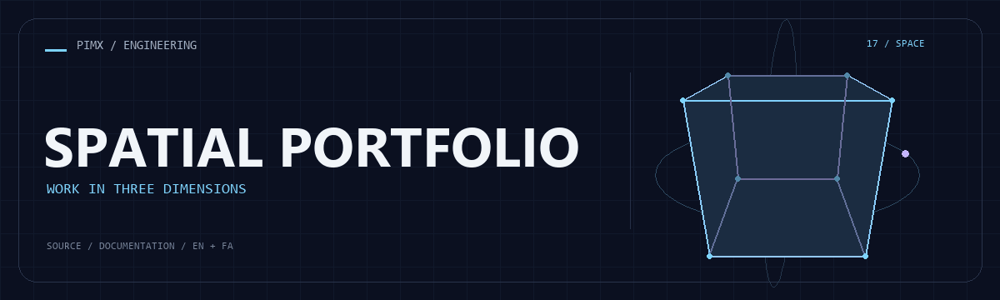

<div align="center">



**[English](README.md) · [فارسی](README.fa.md)**


</div>

# SPATIAL PORTFOLIO

نمونه‌کار شخصی با فرانت‌اند React Three Fiber و API پروژه در Express؛ صحنه‌های Three.js و حرکت Framer Motion به نمایش پروژه‌ها شکل می‌دهند.

[GitHub](https://github.com/MOHAMMADREZAABEDINPOOR/3d-animated-interactive-portfolio) · [PIMX / Profile](https://github.com/MOHAMMADREZAABEDINPOOR) · [بنر ثابت](assets/readme/hero.png)

## امکانات

- صحنه سه‌بعدی اصلی و صحنه‌های مکمل
- بخش معرفی، مهارت‌ها، ارزش‌ها و پروژه‌ها
- استفاده از React Three Fiber، Drei و Framer Motion
- کلاینت Vite و سرور Express مستقل

## پشته فنی

| ابزار | نسخه یا منبع |
|---|---|
| Node.js | `package.json` |

## شروع کار

Node.js 22.12 یا بالاتر و مدیر پکیج مشخص‌شده در package.json. نسخه وابستگی‌ها را مطابق فایل قفل نصب کنید.

```bash
git clone https://github.com/MOHAMMADREZAABEDINPOOR/3d-animated-interactive-portfolio.git
cd 3d-animated-interactive-portfolio

npm ci
npm --prefix client install
npm --prefix server install
npm run dev
```

## تنظیمات

کلیدهای زیر از فایل نمونه یا کد استخراج شده‌اند؛ همه الزاماً اجباری نیستند. مقدار و پیش‌فرض را در همان فایل بررسی و اسرار را فقط در محیط محلی یا هاست تنظیم کنید.

| نام | کاربرد |
|---|---|
| `PORT` | تنظیم برنامه؛ تعریف را در منبع بررسی کنید |

## استفاده

وابستگی ریشه، client و server را نصب و dev را از ریشه اجرا کنید. پیش از معرفی سایت، داده پروژه و متن نمونه‌کار را به‌روز کنید.

## ساختار پروژه

| مسیر | نقش |
|---|---|
| [`assets/`](assets/) | فایل برند، رسانه و README |
| [`client/`](client/) | برنامه مرورگر |
| [`server/`](server/) | پیاده‌سازی سرور |
| [`package.json`](package.json) | فایل ورودی یا تنظیم پروژه |

## فرمان‌ها و بررسی

```bash
npm run dev
npm run build
npm run start
```

این‌ها فرمان‌های موجود در package.json هستند؛ فهرست بالا گزارش اجرای آزمون نیست. فرمان تست ممکن است مرورگر، سرویس یا دیتابیس آماده بخواهد.

## استقرار

خروجی build را مطابق معماری منتشر کنید: پروژه دارای server به فرایند Node نیاز دارد؛ رابط Vite استاتیک می‌تواند از dist میزبانی شود. توابع Pages، KV یا D1 به تنظیم مستقل نیاز دارند.

## محدودیت‌ها

رندر WebGL به مرورگر و GPU وابسته است. برای موبایل ممکن است صحنه ساده‌تر لازم باشد. سرور API باید جدا از فرانت‌اند استاتیک میزبانی شود.

## رفع مشکل

- پکیج غایب: وابستگی را با مدیر پکیج پروژه نصب کنید.
- خطای API یا شبکه: آدرس، سرویس و اتصال میزبانی را بررسی کنید.
- فایل قدیمی: در صورت وجود اسکریپت ساخت، build و کش مرورگر را تازه کنید.

## مشارکت

برای تغییر، شاخه مستقل بسازید، رفتار فعلی را بررسی کنید و توضیح روشن همراه تغییر بفرستید. اطلاعات خصوصی، خروجی build و دیتابیس محلی را commit نکنید.

## مجوز

فایل مجوز در این نسخه موجود نیست. نمایش عمومی کد به‌تنهایی مجوز استفاده مجدد نیست؛ برای شرایط استفاده با مالک مخزن هماهنگ کنید.

---

ساخته‌شده در مجموعه **PIMX** · مستندات فارسی و انگلیسی.
